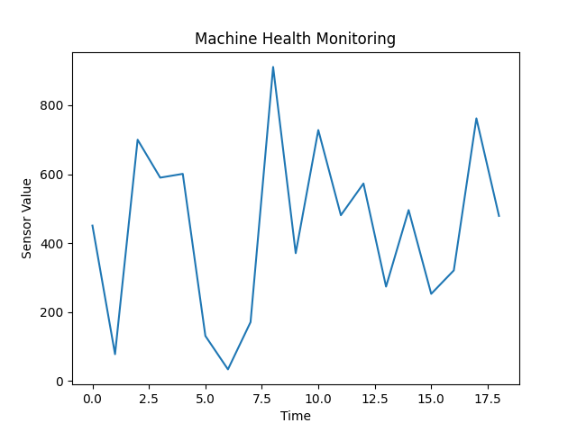

<h1 align="center">⚙️ Machine Health Monitoring System (IoT Simulation)</h1>

  A real-time monitoring system that simulates industrial sensor data to track machine health, classify operating conditions, and detect anomalies for early fault identification.

<h2>🧠 Overview</h2>

This project demonstrates a simulated IoT-based machine health monitoring system. It mimics how sensor data from industrial equipment can be processed in real time to identify abnormal conditions and enable proactive maintenance.

The system focuses on core concepts such as real-time data processing, condition classification, anomaly detection, and continuous monitoring through visualization.

<h2>✨ Features</h2>
<ul>
  <li>📡 Simulated real-time sensor data generation</li>
  <li>⚙️ Condition classification (Normal / Warning / Fault)</li>
  <li>🚨 Anomaly detection for sudden spikes</li>
  <li>📊 Live data visualization using Matplotlib</li>
  <li>💾 CSV-based data logging for analysis</li>
</ul>

<h2>🏗️ System Architecture</h2>
<ul>
  <li><strong>Sensor Layer:</strong> Simulated data representing machine conditions</li>
  <li><strong>Processing Layer:</strong> Classification + anomaly detection logic</li>
  <li><strong>Monitoring Layer:</strong> Visualization and logging</li>
</ul>

<h2>⚙️ Tech Stack</h2>
<ul>
  <li>Python</li>
  <li>Matplotlib</li>
  <li>Standard Libraries (random, time)</li>
</ul>

<h2>🚀 How to Run</h2>

<pre>
pip install -r requirements.txt
python src/monitor.py
</pre>

<h2>📊 Output</h2>
<ul>
  <li>Console logs showing sensor values and system status</li>
  <li>Live updating graph for real-time monitoring</li>
  <li>CSV file storing historical data</li>
</ul>

<h2>📌 Use Case</h2>

This system can be used for monitoring industrial machines to detect abnormal behavior early, reduce downtime, and support predictive maintenance strategies.

<h2>💡 Future Improvements</h2>
<ul>
  <li>Integration with real IoT sensors (Arduino / embedded systems)</li>
  <li>Machine learning-based anomaly detection</li>
  <li>Cloud-based monitoring dashboard</li>
</ul>

<h2>📷 Demo</h2>

<h2>💬 Final Note</h2>

This project focuses on building a clear and practical understanding of IoT-based monitoring systems. It demonstrates how real-time data can be used to make intelligent decisions in industrial environments.

