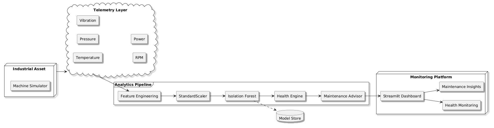
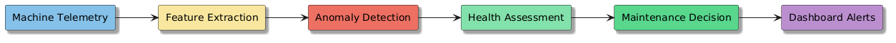
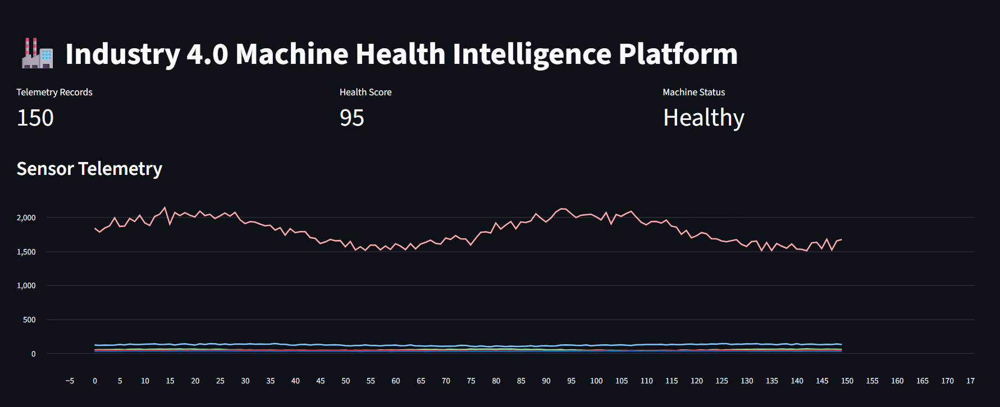
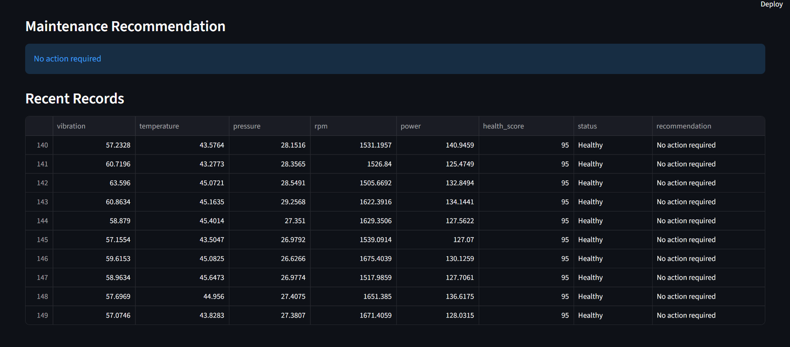

# 🏭 Industry 4.0 Machine Health Intelligence Platform

### Industrial IoT • Predictive Maintenance • Digital Twin • Anomaly Detection


---

## 🚀 Overview
This project implements an Industry 4.0-inspired Machine Health Intelligence Platform capable of simulating industrial machine telemetry, performing anomaly detection using Isolation Forest, generating health scores, and providing predictive maintenance insights through an interactive Streamlit dashboard.

### Core Capabilities
- Industrial Telemetry Simulation
- Predictive Maintenance
- Anomaly Detection
- Health Scoring
- Maintenance Recommendations
- Digital Twin Concepts
- Real-Time Monitoring

---

## 📡 Sensor Telemetry

The platform simulates:
- Vibration
- Temperature
- Pressure
- RPM
- Power Consumption

Additional behavior:
- Sensor Noise
- Sensor Drift
- Fault Injection
- Dynamic Operating Conditions

---

## 🧠 Machine Learning Pipeline

1. Telemetry Generation
2. Feature Engineering
3. StandardScaler
4. Isolation Forest
5. Anomaly Detection
6. Health Assessment
7. Maintenance Recommendation

---

## 🏗️ Architecture






---

## 📊 Dashboard Screenshots

### Platform Overview



### Maintenance Insights




## ⚙️ Technology Stack

- Python
- Pandas
- NumPy
- Scikit-Learn
- Streamlit
- Joblib

---

## 📂 Project Structure

```text
Machine-Health-Monitoring-System
│
├── sensor_simulator.py
├── feature_engineering.py
├── anomaly_detector.py
├── train.py
│
├── dashboard/
│   └── app.py
│
├── models/
│   └── model.pkl
│
├── assets/
│   ├── architecture.png
│   ├── dashboard-overview.png
│   └── dashboard-details.png
│
└── README.md
```

---

## 🚀 Installation

```bash
pip install -r requirements.txt
python train.py
streamlit run dashboard/app.py
```
## 🎯 Industry Applications

- Industrial IoT
- Smart Manufacturing
- Predictive Maintenance
- Digital Twins
- Asset Intelligence
- Industry 4.0 Systems

